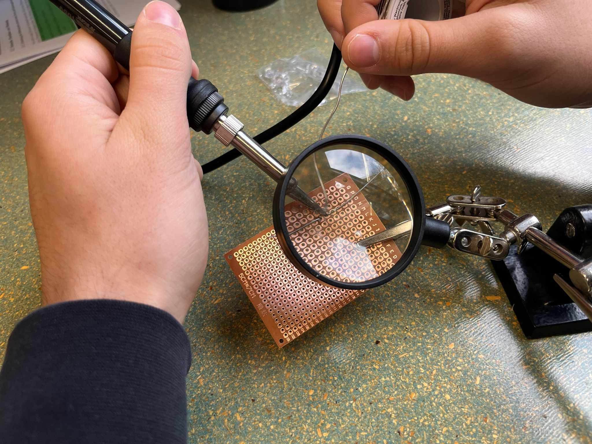
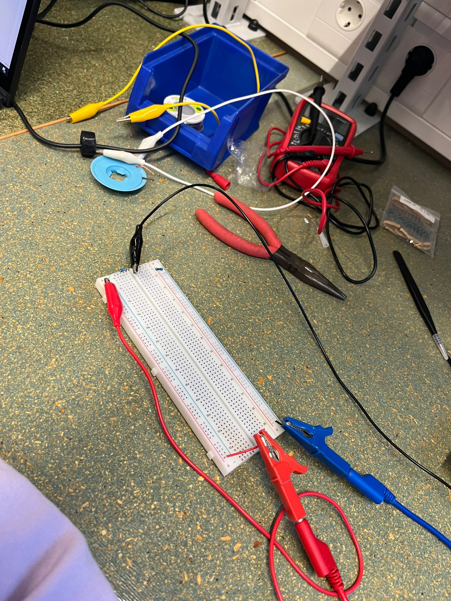
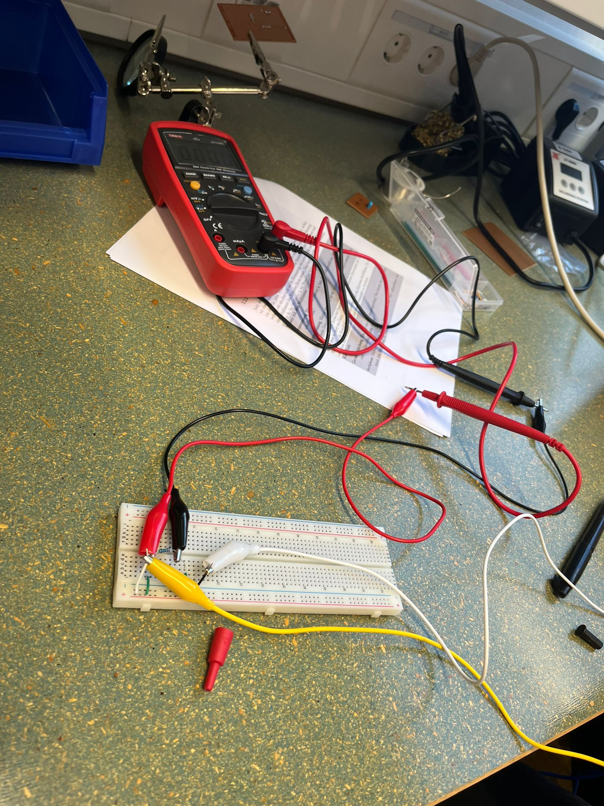

## Elektrotechnik Labor

Am Mittwoch, den 02.11.22 wurde im Labor nach einer Einführung über die Grundlagen der Elektrotechnik beigebracht wie man lötet. Dabei wurden Übungsplatinen verwendet und darauf verschiedene Teile gelötet. 

Nach ein paar Tests war das Ergebniss schon sichtbar. Die Teile waren fest mit der Platine verankert und löten stellte sich als nicht besonders kompliziert heraus. Ich hatte vorher noch nie gelötet, deshalb war für mich alles neu. 

Anschließend wurden Versuche durchgeführt bei denen Stromkreise gelegt und Messungen durchgeführt wurden. Dafür kamen ein oder mehrere Multimeter zum Einsatz. Beispielsweise sollte man den Widerstand berechnen indem man einen unbekannten Widerstand an das Versuchsnetzteil anschließt und mithilfe des Ohmschen Gesetz bestimmen, um welchen Widerstand es sich handelt.

