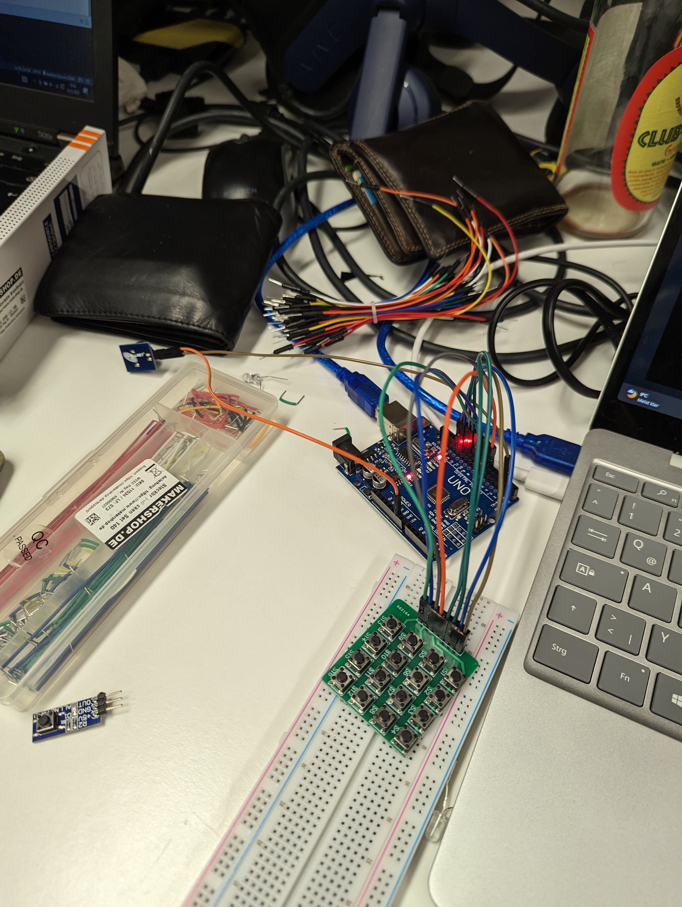
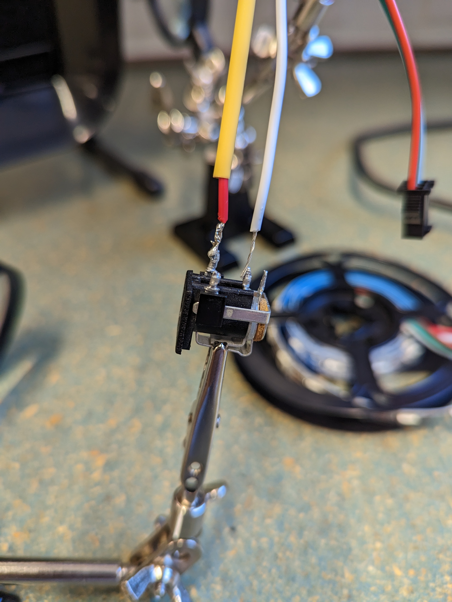

---
title: "Experimente mit Arduino"
date: 2022-12-06T17:37:41+01:00
draft: false
--- 

## 16. November 2022

 In diesem Blogpost ist in drei Teile unterteilt, für jeden Tag ein Teil. Im ersten davon geht es um den 16. November 2022 an dem wir uns an die ersten kleineren Experimente mit dem Arduino, verschiedenen Sensoren und sonstigem Zubehör herangewagt haben. Mein erster Versuch war es, eine LED zum leuchten zu bringen und mit dem Arduino anzusteuern. Das stellte sich als leichter heraus wie gedacht, da die Funktionsweise relativ selbsterklärend war. Danach wollte ich einen Button verwenden der de LED zum leuchten bringt wenn er gedrückt wird. 

 Da auch das ohne größere Probleme funktioniert hat, wollte ich ein neues Bauteil ausprobieren. Mithilfe eines kleinen Speakers und einer Matrix aus Buttons versuchte ich eine Art "Klavier" zu bauen das je nach dem welcher der 16 Buttons gedrückt wurde, einen verschieden hohen Ton von sich gibt. Die Verkabelung ging mithilfe einer Anleitung recht intuitiv, allerdings war das Problem dann softwareseitig. Zunächst musste ich die Buttons in einem Array speichern und ihnen anschließend die richtigen Töne zuweisen. 

## 23. November 2022

Ich hatte mich mittlerweile für das Straßenkarten-Projekt entschieden, bei dem man im 3d-Drucker eine Topologie von Ulm ausdruckt und dann an den Stellen wo S-Bahn Stationen sind LEDs anbringt. Dank der SWU-API ist es möglich, die LEDs leuchten zu lassen wenn sich die S-Bahn live an der entsprechenden Haltestelle befindet. 

An diesem Tag war mein Ziel mit einem LED-Strip herumzuspielen um schonmal einzelne LEDs des Bands anzusteuern. Um allerdings das mit 12 Volt betriebene LED-Strip mit dem Arduino kompatibel zu machen (Mein Arduino hatte nur eine 5V Stromversorge) musste ich ein Bauteil ranlöten um die Kompatibilität herzustellen. 

Im Laufe der weiteren 