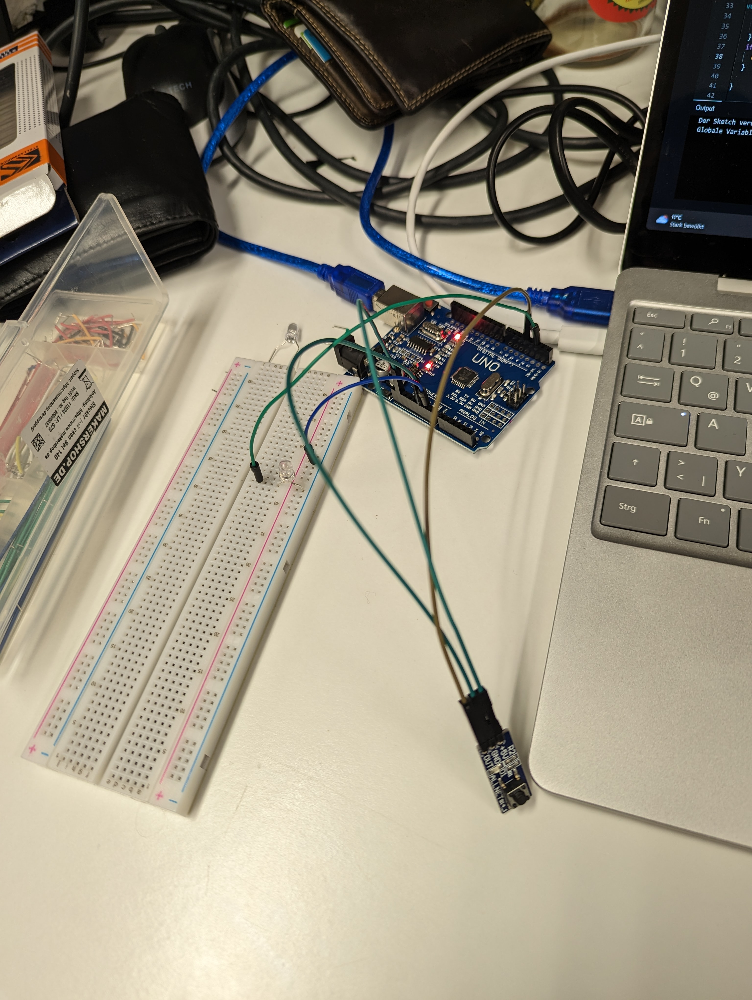

---
title: "Experimente mit Arduino"
date: 2022-12-06T17:37:41+01:00
draft: false
--- 

## 16. November 2022

 In diesem Blogpost ist in drei Teile unterteilt, für jeden Tag ein Teil. Im ersten davon geht es um den 16. November 2022 an dem wir uns an die ersten kleineren Experimente mit dem Arduino, verschiedenen Sensoren und sonstigem Zubehör herangewagt haben. Mein erster Versuch war es, eine LED zum leuchten zu bringen und mit dem Arduino anzusteuern. Das stellte sich als leichter heraus wie gedacht, da die Funktionsweise relativ selbsterklärend war. Danach wollte ich einen Button verwenden der de LED zum leuchten bringt wenn er gedrückt wird (siehe Bild).



